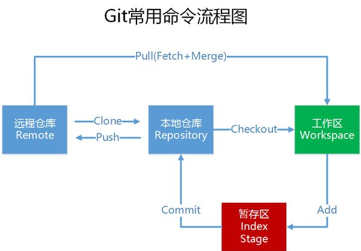

git学起来很快，但是不经常使用肯定忘的一塌糊涂
所以下面只简单明了的记录自己的理解和一些自己常用的命令,遇见其他应用在添加，更多的当然去查找手册
学习git，我是看[廖雪峰的GIT教程](https://www.liaoxuefeng.com/wiki/0013739516305929606dd18361248578c67b8067c8c017b000)

<!-- more -->
# 概述
git其实就是`分布式版本控制系统`

# 常用命令
在正常运用中一般也只会用到以下数个命令，引用一下别的的图

#### 初始化
`git init [dir]` # 创建git仓库
`git init --bare [dir]` # 创建裸库
裸库中无法编辑文件或者提交更改，适合作为中心仓库来存储数据。

`git config [--global] user.name "[name]"`
`git config [--global] user.email "[email address]"`
#### 操作
`git clone [url]` # 复制一个现有的仓库

`git add .` # 添加当前目录所有文件，工作区→暂存区
`git add --all` # 同上，`GIT2.0`以上可以不用加`-all`

`git commit -m [message]` # 暂存区→本地仓库

`git remote -v` # 查看所有远程仓库
`git remote add [name] [url]` # 增加远程仓库并且命名
`git push -u [origin] [branch]` # 本地仓库→远程仓库
`-u`代表将本地和远程的`master`分支关联，之后提交项目只需要`git push` 即可

`git pull` # 远程仓库→工作区

#### 版本回退
`git reset [file]` # 重置暂存区的某个文件，与最后一次commit一致
`git reset --hard` # 重置工作区和暂存区，回退到上一个commit
`git reset --hard [commitId]` # 重置工作区和暂存区，回退到指定commit

`git checkout [file]` # 恢复暂存区某文件到工作区
`git checkout .` # 恢复暂存区所有文件到工作区
`git checkout [commit] [file]` # 恢复指定commit的指定文件到工作区和暂存区

#### 分支
`git branch` # 列出所有分支
`git checkout -b [branch]` # 创建指定分支，并切换
`git checkout [branch]` # 切换到指定分支
`git checkout -d [branch]` # 删除指定分支
`git merge [branch]` # 自动合并当前分支和指定分支

#### 冲突处理
`git add [filename]` # 修改冲突后，标记
`git diff [source_branch] [target_branch]` # 对比两个分支差异

#### 信息查看
`git status` # 查看变更文件
`git diff` # 显示暂存区和工作区的差异
`git diff HEAD` # 显示工作区和当前分支最新commit差异
`git log` # 版本历史
`git log -5 --pretty=oneline` # 单行显示最近5条

#### 其他
`gitk` # 图形化git

# 工作流程
#### 开发流程
自我理解的，在个人开发上感觉一般用不上
从master创建分支→进入分支开发→开发完成提交记录→切换到master分支→`pull`最新代码→合并解决冲突→推送服务端

#### bug分支
存储当前→从master创建分支→进入分支修复bug→合并解决冲突→删除bug分支→进入工作分支→恢复→继续工作
`git stash` # 存储当前工作
`git stash drop` # 删除stash
`git stash apply <stash@{0}>` # 恢复
`git stash pop` # 恢复后同时删除
`git stash list` # 查看
